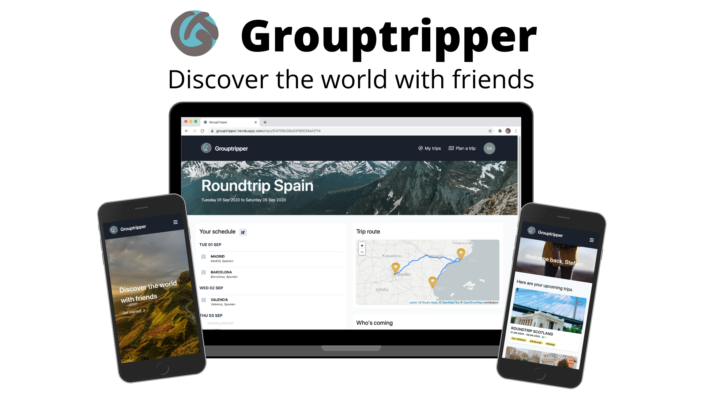
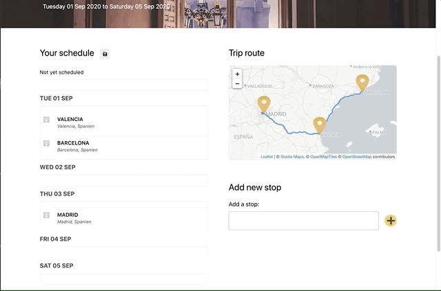

# Group Tripper

## Discover the world with friends

<!-- ALL-CONTRIBUTORS-BADGE:START - Do not remove or modify this section -->

<!-- ALL-CONTRIBUTORS-BADGE:END -->

Grouptripper is an App to plan Trips with your friends and family.

## Live Demo

🛠 currently not available

The Frontend and Backend were hosted on one [Heroku](heroku.com) Dyno, the database was served from the MongoDB Atlas Cloud.

## Features

Setup a basic trip Itinerary with a short description, your country of destination along with your trip dates and add some stops.

Easily invite your Friends and Family to collaborate on your planning.

After accepting your invite, your co-travellers
can add stops or reorder them and add comments to the your trip.

## Project Presentation

Grouptripper was developed as a Thesis Project for the Codeworks Bootcamp by <a href="https://github.com/AlexKMarshall"><b>Alex Marshall</b></a>, <a href="https://github.com/MohammedAK1991"><b>Mohammed Abdul Khader</b></a> and <a href="https://github.com/hucki"><b>Stefan Huckschlag</b></a>.

Here you can find a video of the project presentation:

## Getting started

These instruction will help you setup a local development instance of the app.

### get the repo

`git clone https://github.com/hucki/grouptripper.git`

### install the dependencies

`npm install`

### Setup prerequisites

For an example how to fill `/server/.env` see `/server/.env.example`
For an example how to fill `/client/.env.local` see `/client/.env.local.example`

#### Database

1. set up a mongoDB database locally or as a hosted service
2. choose a database name and set `DB_NAME` in `/server/.env`
3. set `DB_USER` and `DB_PASS` in `/server/.env`

##### local DB

Only if you want to run the DB locally follow theses steps:

1. set `DB_LOCAL=true` in `/server/.env`
2. set `DB_LOCAL_URI` and `DB_LOCAL_PORT` in `/server/.env` as shown in the example file

##### remote DB

Only if you want to run the DB remotely follow theses steps:

1. set `DB_LOCAL=false` in `/server/.env`
2. set `DB_URI_PROTOCOL`, `DB_URI_HOST` and `DB_URI_PARAMS` in `/server/.env` as shown in the example file

**Hint:** For debugging and/or development purposes, you can set up databases both locally and remotely and switch between them by setting `DB_LOCAL` to true or false

#### Mail provider

- add `EMAIL_USER` and `EMAIL_PASSWORD` to `/server/.env`

#### Authentication

Set up an Application on [auth0](https://auth0.com) and add `AUTH0_DOMAIN`, `AUTH0_CLIENTID`, `AUTH0_CLIENT_SECRET` and `AUTH0_AUDIENCE` to `/server/.env`

#### APIs

- [unsplash](https://unsplash.com): apply for an API key and add to `/server/.env`
- [openrouteservice](https://openrouteservice.org): apply for an API key and add to `/client/.env.local`

### Start the App

Start client and server in dev mode locally

From the root folder of the project change into `/server` and `npm start`
From the root folder of the project change into `/client` and `npm start`

## Deploy the App

### Build process

To create a build ready for Deployment, just run

`npm run build`

from the root folder of the project. The result will be created in `server/dist` and includes the compiled backend and frontend

### start the App

To start the created build just run

`npm start`

from the root folder of the project.

## Tech-Stack

### Frontend

- [TypeScript](https://www.typescriptlang.org)
- [reactjs](https://reactjs.org)
- [React Query](https://github.com/tannerlinsley/react-query)
- [Leaflet](https://github.com/Leaflet/Leaflet) via [react-leaflet](https://github.com/PaulLeCam/react-leaflet)
- [formik](https://github.com/formium/formik)
- [Tailwind CSS](https://github.com/tailwindlabs/tailwindcss)

### Backend

- [Node.js](https://nodejs.org/)
- [Express](https://expressjs.com)
- [TypeScript](https://www.typescriptlang.org)
- [MongoDB](https://www.mongodb.com)
- [Mongoose](https://mongoosejs.com)

### CI / CD

- [Github Actions](https://github.com/features/actions)
- [Travis CI](https://travis-ci.org)
- [Codecov](https://codecov.io)
- [Heroku Github Sync](https://devcenter.heroku.com/articles/github-integration)

### Hosting

- [heroku](https://heroku.com) for Frontend and Backend
- [MongoDB Atlas](https://www.mongodb.com/cloud/atlas) for the Database

### Authentication

- [Auth0](https://auth0.com)

### APIs

- [openrouteservice](https://openrouteservice.org)
- [unsplash](https://unsplash.com)

## Contributors ✨

Thanks goes to these wonderful people ([emoji key](https://allcontributors.org/docs/en/emoji-key)):

<!-- ALL-CONTRIBUTORS-LIST:START - Do not remove or modify this section -->
<!-- prettier-ignore-start -->
<!-- markdownlint-disable -->
<table>
  <tr>
    <td align="center"><a href="https://github.com/MohammedAK1991"> <b>Mohammed Abdul Khader</b></a> <a href="https://github.com/hucki/grouptripper/commits?author=MohammedAK1991" title="Code">💻</a> <a href="#ideas-MohammedAK1991" title="Ideas, Planning, & Feedback">🤔</a></td>
    <td align="center"><a href="https://github.com/AlexKMarshall"> <b>Alex Marshall</b></a> <a href="https://github.com/hucki/grouptripper/commits?author=AlexKMarshall" title="Code">💻</a> <a href="https://github.com/hucki/grouptripper/commits?author=AlexKMarshall" title="Tests">⚠️</a> <a href="#design-AlexKMarshall" title="Design">🎨</a></td>
    <td align="center"><a href="https://github.com/hucki"> <b>Stefan Huckschlag</b></a> <a href="https://github.com/hucki/grouptripper/commits?author=hucki" title="Code">💻</a> <a href="#infra-hucki" title="Infrastructure (Hosting, Build-Tools, etc)">🚇</a><a href="#design-hucki" title="Design">🎨</a></td>
  </tr>
</table>

<!-- markdownlint-enable -->
<!-- prettier-ignore-end -->

<!-- ALL-CONTRIBUTORS-LIST:END -->

This project follows the [all-contributors](https://github.com/all-contributors/all-contributors) specification. Contributions of any kind welcome!
